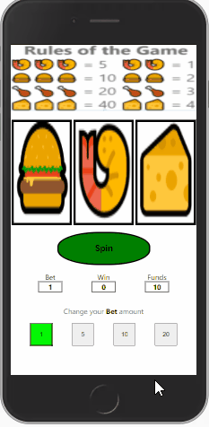
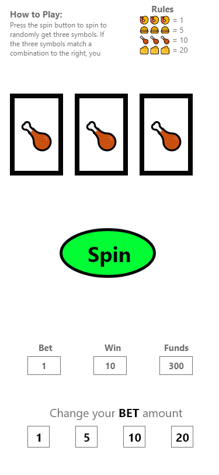

# Slot Machine

### Project Demo Link: [Slot Machine](https://slot-machine.netlify.app/)

### Table of Contents

1. Purpose
2. Motivation
3. Wireframe
4. How to play
5. Technologies Used

### Purpose:

Slot machine web game where users spin reels to get random combinations

### Motivation:

The goal was to practice building apps in shorter time periods with React.

### WireFrame

### How to play:

- User will click the spin button to make the reels spin randomly. The user will win points based on the points received for the random combination. 
- Users can change the bet amount. 

### This app was built with the following technologies:

**React:** JavaScript front-end library for building user interfaces

**Git-Hub:** Web-based version control repository and Internet hosting service

**Abode XD** A wire-framing tool used to create a mockup/visual of what is to be coded

**JavaScript:** Object-oriented programming language for web pages

**HTML:** Mark-up language for creating web pages

**CSS:** A formatting language for styling web pages

_Created by JC Smiley in December of 2020_
